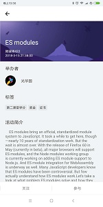

## 柴火
柴火移动版本

**Support:react-native 0.54.0 react 16.3.0-alpha.1**

### Screenshot

### 功能说明
- 

### Getting Started  
1. Install: `npm istall`  

2. ~~Link: `react-native link` . To link react-native-vector-icons.~~

3. Run on an Android Phone: `react-native run-android` . Then you can see it.

### Contributing

PRs and issues are welcome
### License

This project is licenced under the [MIT License](http://opensource.org/licenses/mit-license.html).

### TODO List

- [x] 概念版
- [ ] 用户注册、登录、登出
- [x] 用户查看活动，多入口跳转到活动列表
- [x] 用户关注、参与活动，留言
- [x] 用户分享活动到朋友圈
- [x] 用户查看组织详情
- [x] 用户查看其他用户详情
- [x] 用户朋友圈
- [x] 用户信息中心，查看信息、回复信息
- [x] 组织创建
- [x] 组织人员管理，接纳新成员，踢出成员
- [ ] 组织角色管理
- [ ] 组织成员授权
- [x] 组织发布活动
- [ ] 组织角色用户以组织名义回复信息和转发活动
- [ ] 组织统计信息
- [ ] 数据对接
